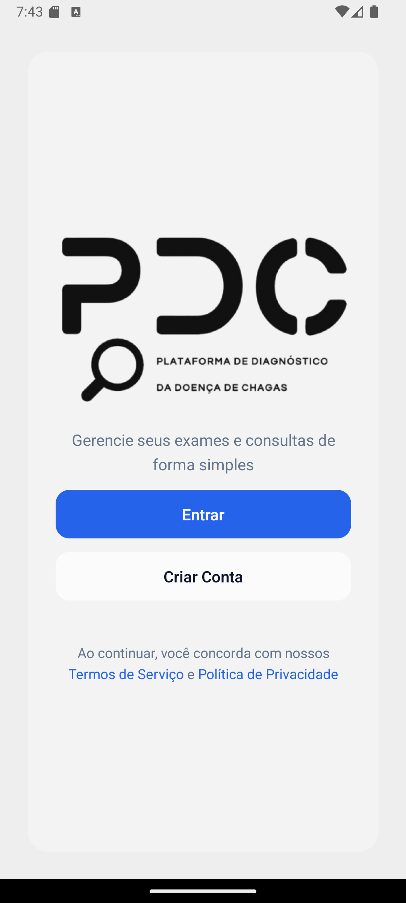
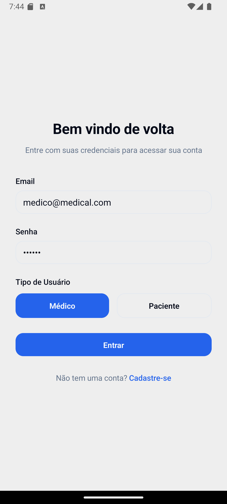
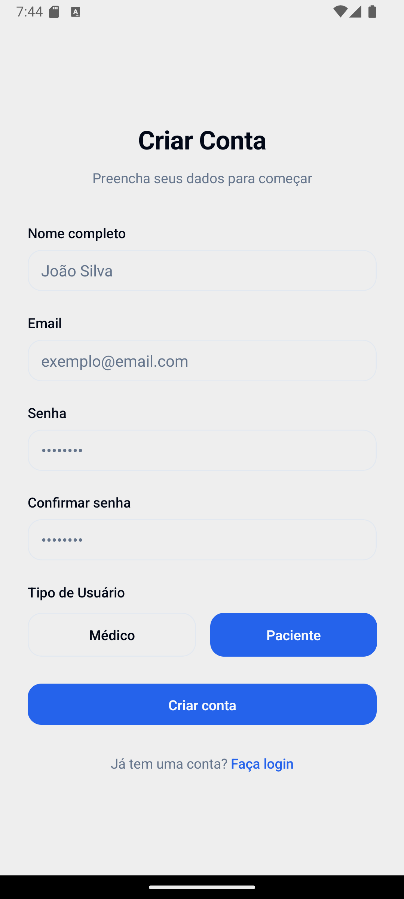
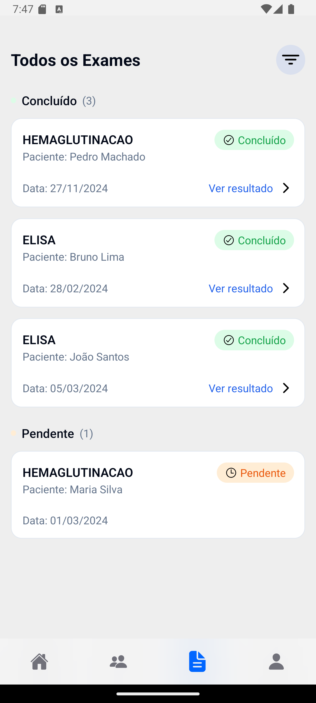
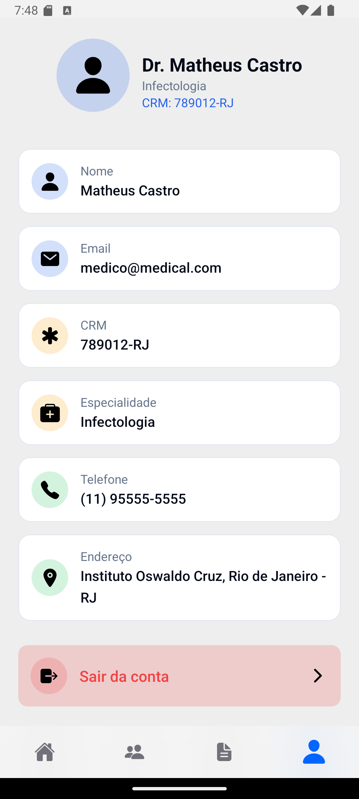
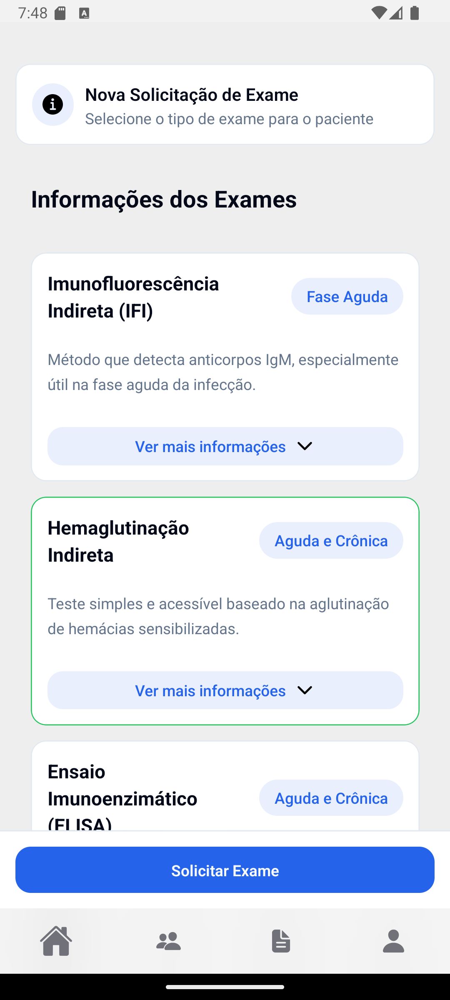
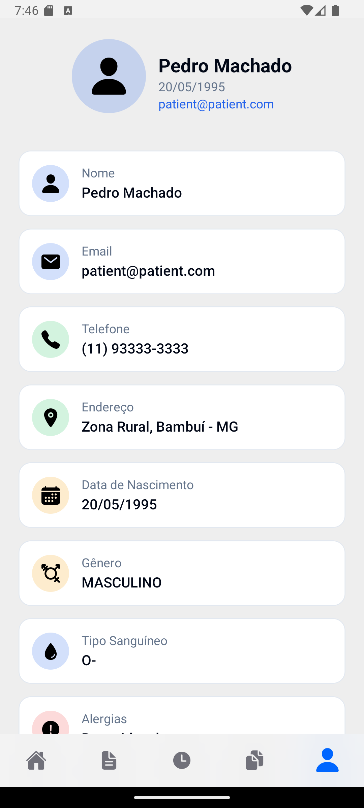

# PDC - Plataforma de Diagnóstico da Doença de Chagas

Um aplicativo móvel desenvolvido com React Native e Expo para gerenciamento de prontuários médicos digitais. O PDC permite que médicos e pacientes acessem e gerenciem informações médicas de forma segura e eficiente.

## 📱 Sobre o Projeto

O PDC é uma solução moderna para digitalização e compartilhamento de prontuários médicos, oferecendo:

- Interface dedicada para médicos e pacientes
- Gerenciamento de exames e histórico médico
- Sistema de autenticação seguro
- Design responsivo e intuitivo
- Suporte a iOS e Android

## 🤝 Screenshots

<div align="center">
  <h3>Telas de Autenticação</h3>
  <div style="display: flex; flex-wrap: wrap; gap: 20px; justify-content: center; margin-bottom: 40px;">
    
    
    
  </div>

  <h3>Área do Médico</h3>
  <div style="display: flex; flex-wrap: wrap; gap: 20px; justify-content: center; margin-bottom: 40px;">
    
    
    
    
  </div>

  <h3>Área do Paciente</h3>
  <div style="display: flex; flex-wrap: wrap; gap: 20px; justify-content: center;">
    
    
  </div>
</div>

## 🚀 Tecnologias Utilizadas

- React Native
- Expo
- TypeScript
- TailwindCSS (Nativewind)
- React Query
- React Navigation
- Reanimated
- Safe Area Context
- Expo Router

## ⚙️ Pré-requisitos

Antes de começar, você precisa ter instalado em sua máquina:

- [Node.js](https://nodejs.org/) (v18 ou superior)
- [npm](https://www.npmjs.com/)
- [Git](https://git-scm.com/)
- [Expo CLI](https://docs.expo.dev/get-started/installation/)
- [Android Studio](https://developer.android.com/studio) (para emulador Android)
- [Xcode](https://developer.apple.com/xcode/) (para simulador iOS - apenas macOS)

## 🔧 Instalação e Configuração

1. Clone o repositório:

   ```bash
   git clone https://github.com/Couks/pdc.git
   cd pdc
   ```

2. Instale as dependências do projeto:

   ```bash
   npm install

   ```

3. Instale e configure o json-server:

   ```bash
   npm install -g json-server
   ```

4. Inicie o servidor mock (em um terminal separado):

   ```bash
   npm run server
   ```

5. Inicie o projeto Expo:

   ```bash
   npx expo start
   ```

Ao ser inciciado, o servidor mock estará disponível em `http://localhost:3000` e o Metro Bundler do Expo será iniciado automaticamente. Você pode então executar o aplicativo em um emulador/simulador ou dispositivo físico usando os comandos exibidos no terminal.

### Usando Emulador:

1. Inicie seu emulador Android/iOS
2. Pressione 'a' para Android ou 'i' para iOS no terminal

## 🔑 Contas de Teste

Você pode usar os usuários salvos no json-server para teste:

### Médico

- Email: doctor@example.com
- Senha: 123456

### Paciente

- Email: patient@example.com
- Senha: 123456

## 🎯 Funcionalidades Principais

### Portal do Médico

- Gerenciamento de pacientes
- Solicitação de exames
- Análise de resultados
- Dashboard com estatísticas

### Portal do Paciente

- Visualização de exames
- Histórico médico
- Acompanhamento de diagnósticos
- Perfil com dados clínicos

## 🤝 Contribuindo

1. Faça um fork do projeto
2. Crie uma branch para sua feature (`git checkout -b feature/AmazingFeature`)
3. Commit suas mudanças (`git commit -m 'Add: nova feature'`)
4. Push para a branch (`git push origin feature/AmazingFeature`)
5. Abra um Pull Request
